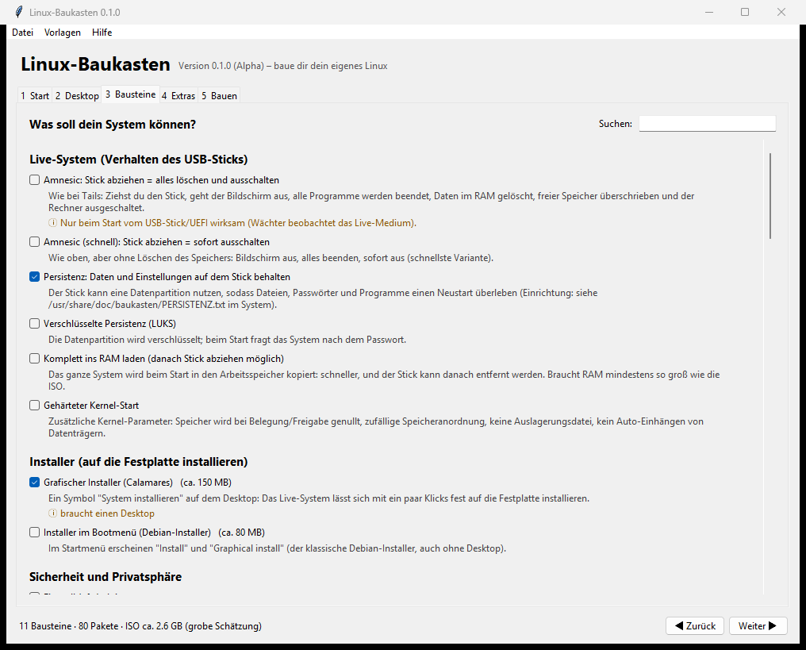
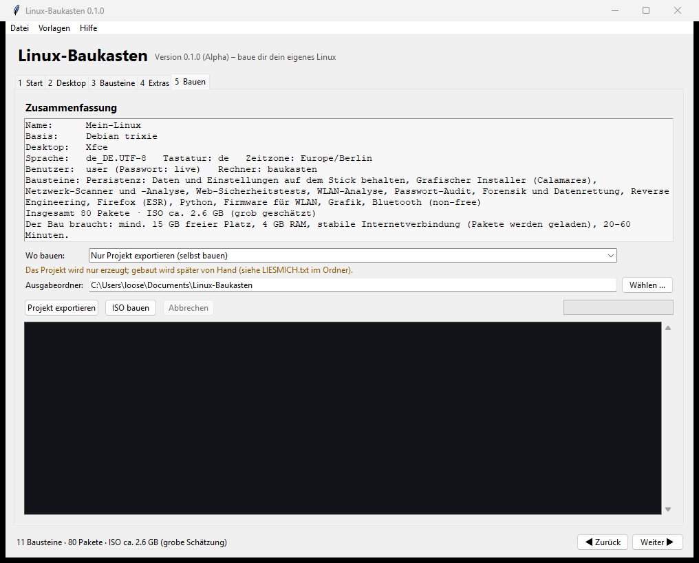

# Linux-Baukasten

**Baue dir dein eigenes Linux – per Mausklick.** Ein kleines Programm mit Oberfläche (für Windows als einzelne **EXE**, sonst mit Python),
in dem du ein Basissystem, einen Desktop und beliebige **Bausteine** auswählst – und daraus eine startbare **ISO** bekommst:
als **Live-System für den USB-Stick**, mit **Installer**, als **Rettungssystem**, **Wegwerf-System** und vieles mehr.

> ⚠️ **Alpha (Version 0.1).** Der Katalog und der Projekt-Generator sind getestet, die Paketnamen sind gegen das echte Debian-Archiv geprüft, alle 8 Vorlagen
> wurden **wirklich zu ISOs gebaut**, und das Wegwerf-System wurde in einer VM gestartet (Stick abziehen → aus). Auf echter Hardware ist es noch nicht getestet –
> siehe [Teststand](#teststand-ehrlich). English: [README.en.md](README.en.md).



## Was du zusammenbauen kannst

| Vorlage | Idee |
|---|---|
| **Wegwerf-System** (Tails-artig) | Startet von USB, speichert nichts; **Stick abziehen = alles weg** (Bildschirm aus, RAM gelöscht, Rechner aus). Firewall, Härtung, Privatsphäre-Werkzeuge |
| **Sicherheits-Werkzeugkasten** (Kali-artig) | Netzwerk-, Web-, WLAN-, Passwort-, Forensik- und Reverse-Engineering-Werkzeuge; optional installierbar |
| **Alltags-System** (Ubuntu/Mint-artig) | Browser, Büro, Multimedia, Drucken, Flatpak, grafischer Installer |
| **Rettungssystem** (SystemRescue-artig) | Datenträger retten, Windows reparieren, Hardware prüfen – lädt ins RAM |
| **Entwickler-Arbeitsplatz** | Compiler, Python, Node, Java, Go/Rust, Container |
| **Gaming-Live-System** | Freie Spiele, Wine, Lutris, GameMode, Vulkan |
| **Minimaler Server** | Kein Desktop, SSH nur mit Schlüssel, Firewall, Fail2ban |
| **Leichtes System** | LXQt, komprimierter RAM – läuft auch mit 2 GB |

Jede Vorlage ist nur ein Startpunkt: **7 Desktops** (Xfce, GNOME, KDE Plasma, LXQt, MATE, Cinnamon, i3) oder gar keiner und **55 Bausteine** in
10 Kategorien lassen sich beliebig kombinieren – darunter Live-Verhalten (**Amnesic** wie bei Tails, **Persistenz**, verschlüsselte Persistenz, **toram**),
**Installer** (Calamares oder Debian-Installer), Sicherheit (Firewall, AppArmor, Kernel-Härtung, MAC-Zufall, Tor, VPN), Pentest, Büro, Entwicklung, Spiele,
Rettung, Server und Komfort (Flatpak/Flathub, Firmware, zram ...). Die komplette Liste mit Beschreibung: **[docs/BAUSTEINE.md](docs/BAUSTEINE.md)**.
Fehlt dir etwas? Zusätzliche Debian-Pakete und Kernel-Parameter kannst du von Hand eintragen, und eigene Bausteine sind in wenigen Zeilen [selbst hinzugefügt](#eigene-bausteine).

## So geht's

1. **Herunterladen:** auf der Seite [**Releases**](https://github.com/LurNyx/Linux-Baukasten/releases/latest) die Datei **`Linux-Baukasten.exe`** laden
   (Windows). Beim ersten Start warnt SmartScreen eventuell, weil die Datei nicht signiert ist: *Weitere Informationen → Trotzdem ausführen.*
   Alternativ mit Python 3: `python Linux-Baukasten.pyw` (keine weiteren Pakete nötig).
2. **Vorlage wählen** (Reiter 1), Desktop wählen (Reiter 2), **Bausteine** ankreuzen (Reiter 3), bei Bedarf Extras (Reiter 4).
   Konflikte löst das Programm selbst („passt nicht zusammen"), die Größe der ISO wird geschätzt.
3. **Reiter „Bauen":** Zusammenfassung ansehen, Ausgabeordner wählen und
   - **„Projekt exportieren"** – erzeugt einen Ordner, aus dem du auf jedem Debian-System mit `sudo ./build.sh` die ISO baust, oder
   - **„ISO bauen"** – baut direkt, wenn **WSL** (Windows), **Docker** oder ein **Linux** vorhanden ist. Das Programm zeigt, was verfügbar ist.
4. Die fertige **ISO auf einen USB-Stick schreiben** (z. B. mit [Rufus](https://rufus.ie) oder [balenaEtcher](https://etcher.balena.io)) und davon starten.



**Ohne Oberfläche** geht es auch (Skripte, Server):

```
python Linux-Baukasten.pyw --list                              # Vorlagen und Bausteine anzeigen
python Linux-Baukasten.pyw --export rescue --out ./mein-rescue # Projekt aus einer Vorlage erzeugen
python Linux-Baukasten.pyw --export mein.baukasten.json        # ... oder aus einer gespeicherten Rezept-Datei
sudo ./mein-rescue/build.sh                                    # ISO bauen (Debian/Ubuntu, WSL oder Docker)
```

Rezepte (`*.baukasten.json`) lassen sich speichern, laden und teilen; die Vorlagen liegen als Beispiele in [recipes/](recipes/).

### Was der Bau braucht
Mindestens **15 GB freien Platz**, **4 GB RAM**, Internet (die Pakete werden geladen) und **20–60 Minuten**. Gebaut wird mit
[live-build](https://wiki.debian.org/DebianLive) – am besten auf **Debian 12/13**, in **WSL mit Debian** (`wsl --install -d Debian`) oder in **Docker** (`debian:trixie`).

## Wie es funktioniert

```
Rezept (JSON)  →  Katalog (Bausteine, Pakete, Kernel-Parameter, Dateien)  →  Generator  →  live-build-Projekt  →  ISO
```

Jeder Baustein ist eine Handvoll Daten: Debian-Pakete, Kernel-Parameter, Dateien fürs fertige System, Startskripte und Konflikte. Der Generator
schreibt daraus `auto/config` (live-build), die Paketliste, Hooks und `includes.chroot`. Das Ergebnis ist ein gewöhnliches live-build-Projekt, das du
auch von Hand ändern kannst. Der **Amnesic**-Baustein bringt den Wächter aus dem Schwesterprojekt
[Kali Amnesic Stick](https://github.com/LurNyx/kali-amnesic-stick) mit.

## Teststand (ehrlich)

**Automatisch geprüft** (`python tests/run_all.py`, läuft bei jedem Push auf Windows und Linux):
Rezept-Prüfung gegen bösartige Eingaben, Katalog-Konsistenz (Konflikte gegenseitig, Abhängigkeiten, alle Vorlagen gültig),
Generator für jede Vorlage inkl. Shell-Syntaxprüfung aller erzeugten Skripte, Bau-Befehle und Abbruch, Oberfläche (echtes Tk), erzeugte Doku.
**Alle Paketnamen** werden gegen das Debian-Archiv (13 „trixie") geprüft (`python tools/check_packages.py`) – dabei sind schon Fehler aufgefallen
und behoben (`kismet`, `radare2`, `task-english-desktop` gibt es dort nicht; `nikto` und `lutris` liegen in non-free/contrib).

**Echter ISO-Bau:** der Workflow [„ISO bauen (echter Test)"](.github/workflows/build-iso.yml) baut Vorlagen komplett in Docker (Debian 13, live-build).
**Alle 8 Vorlagen bauen erfolgreich durch** (0,7 bis 4,3 GB große ISOs). Die Größen-Schätzung im Programm ist an diese echten Werte angepasst.

**Echter Start:** Die Vorlage „Wegwerf-System" wurde als selbst gebaute ISO in einer Hyper-V-VM gestartet: Das Bootmenü startet von selbst, das System
kommt mit Desktop und Firewall hoch, der **Amnesic-Wächter läuft, und beim „Stick abziehen" (Platte aus der VM entfernt) ist die VM nach ca. 8 Sekunden aus.**
Die Einzelheiten samt aufgefallener und behobener Fehler stehen in [docs/TESTSTAND.md](docs/TESTSTAND.md).

**Nicht geprüft:** Start auf echter Hardware und mit Secure Boot, der Start der übrigen Vorlagen (gebaut, aber nicht gebootet), Installer (Calamares),
Persistenz, der „ISO bauen"-Knopf mit WSL/Docker unter Windows. Berichte sind sehr willkommen (Issues).

## Roadmap

- Weitere Basen: Ubuntu, Arch (archiso), Fedora; Debian „forky" (Testing)
- USB-Stick direkt aus dem Programm beschreiben (Technik aus *Kali Amnesic Stick*)
- Weitere Bausteine, eigene Bausteine per Datei laden, englische Oberfläche
- Vorschau des Bootmenüs, Wartungs-Updates gebauter Systeme

## Eigene Bausteine

Ein Baustein steht in [`baukasten/catalog.py`](baukasten/catalog.py), zum Beispiel:

```python
F("firewall-ufw", "security", "Firewall (ufw) aktiv", "Eingehende Verbindungen werden standardmäßig blockiert.",
  packages=("ufw",),
  hooks=(("0510-ufw", _sh("sed -i 's/^ENABLED=.*/ENABLED=yes/' /etc/ufw/ufw.conf", "systemctl enable ufw.service")),))
```

Danach `python tools/check_packages.py` (Paketnamen gegen Debian prüfen), `python tools/gen_docs.py` (Doku/Beispiele neu erzeugen) und `python tests/run_all.py`.
Pull Requests sind willkommen.

## Hinweise

- **Live-Passwort:** Standard ist Benutzer `user` / Passwort `live` (von Debian-Live). Bitte nach dem Start ändern; der SSH-Baustein erlaubt nur Schlüssel-Login.
- **Werkzeuge mit Missbrauchspotenzial** (Pentest, WLAN, Windows-Passwort): nur an eigenen Systemen bzw. mit ausdrücklicher Erlaubnis einsetzen.
- **Anonymität:** Der Tor-Baustein und das Wegwerf-System ersetzen **kein** Tails.
- „Debian" und „Kali" sind Marken ihrer Inhaber; dieses Projekt ist mit keinem davon verbunden.

## Lizenz

[MIT](LICENSE) – Nutzung auf eigene Verantwortung, ohne Gewähr.

---

### Mehr von mir: Kali Amnesic Stick
Kali Linux als **Live-Stick, der beim Abziehen alles löscht und den Rechner ausschaltet** (Windows und Linux, mit Signaturprüfung und Rückleseprobe):
👉 **[LurNyx/kali-amnesic-stick](https://github.com/LurNyx/kali-amnesic-stick)**
